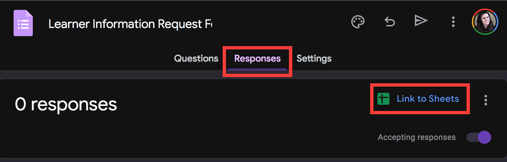
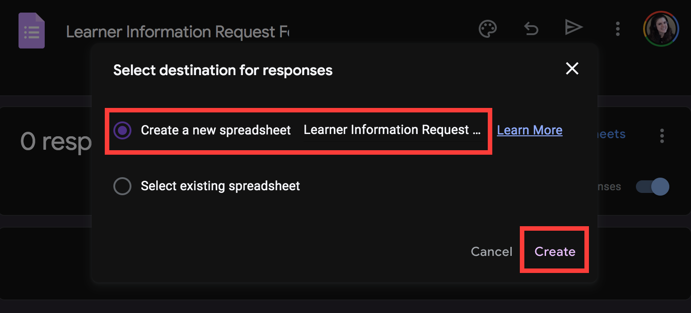
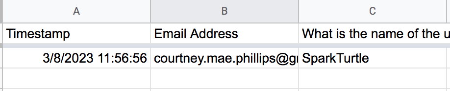

# Google Form Setup

---

## Creating a Google Form

First we'll need a simple Google Form. This self-serve resource will allow stakeholders to request up-to-date LMS metrics on specific groups of learners in the LMS.

**Click [this link](https://docs.google.com/forms/d/1WWOQb1rrzaG91OU0jwOK8i9YSo9Ka2eyiJUeLMTUSWU/copy)**, then the blue **_Make a copy_** button to make a copy of the Google Form used in this project.

Do not alter the questions or settings provided. Keep this up in your browser throughout the module.

## Saving Form Submissions in a Spreadsheet

Next, we'll configure our form to record responses in a Google Sheet. This will serve as both a record of all requests, and an entry point to launch our serverless automation.  

In your copy of the form, select the **_Responses_** tab, then **_Link to Sheets_**.

You will be prompted to either select an existing sheet, or make a new sheet. Select **_Create a new spreadsheet_**, then **_Create_**.

Your new Google Sheet will automatically open in the browser. Keep this and your Google Form available in your browser; we'll use them momentarily.

### Testing the Form

Let's confirm it works!

Revisit your Google Form, select **_Preview_** (👁️) in the upper-right, and submit a response. The submission will appear in your spreadsheet:

---

| [⬅️  Back —]() | [— 🏠 Home —](https://github.com/courtneyphillips/project-canis-educere) | [— Next  ➡️]() |
| --- | --- | --- |
