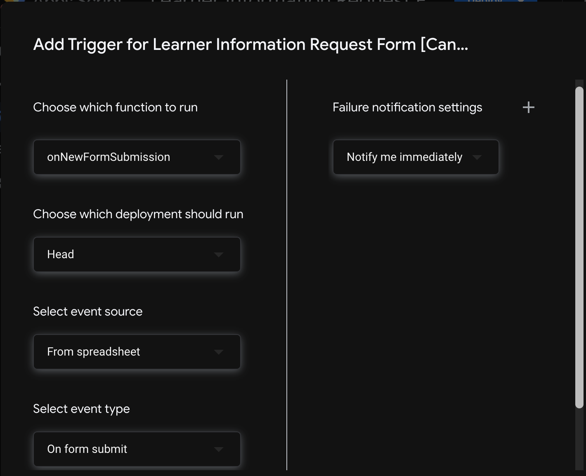

# Google Apps Script Triggers   
---

Next we'll integrate triggers to launch our automated workflow whenever a new form submission is received. Google Sheets supports more expansive scripting options than Forms, so we'll integrate our logic there.

## Accessing Apps Scripts

Navigate to the spreadsheet we just created. Select **_Extensions_** > **_Apps Script_** from the menu bar.


| 🛠️  Project Note |
|--------------------|
| If this is your first time using Google Apps Script, you may be receive a pop-up asking for permissions. Accept all suggested permissions and proceed. |

This will take you to a new Apps Script project:


Because we created this project from our spreadsheet, code here will automatically be associated with our sheet.

We'll rename `myFunction()` and add a logging statement:

_**Code.gs** in Apps Script_
```javascript
function onNewFormSubmission(){
  console.log("hey, our function was invoked!")
}
```

| ⚠️  Important  |
|--------------------|
| The Apps Script editor **_does not automatically save your work_**. Save manually after each change by clicking the save icon (💾), or using the shortcut `CMD + S` on Mac, or `Ctrl + S` on Windows. |

## Defining Triggers

Next, we'll tell our function when to run. In the left sidebar of Apps Script, select **_Triggers_** (⏰). Then click **_Add Trigger_**:


A modal with configuration options will appear. Update each to match the following:



- **Choose which function to run**: `onNewFormSubmission`

- **Choose which deployment should run**: `Head`. This refers to the version meant for publication (as opposed to testing or development). It's a bit like a Git `master` branch.

- **Select event source**: `From spreadsheet`. Even though we're listening for a form submission, we'll run the event from this spreadsheet. As we saw previously, the spreadsheet is automatically listening for new form submissions.

- **Select event type**: `On form submit`. Because our sheet is configured to register form submissions, it has access to this event type.

- **Failure notification settings**: Your choice. We will walk through checking log data to locate errors, but you may opt for additional notifications.

Click _**Save**_ after confirming your settings match.

<details><summary><b>⚠️  A Note on Permissions</b>: Did you receive an "Authorization Required" pop-up upon saving settings? Click here for guidance.  </summary>
<br>
<p>
Depending on your Google account permissions and settings, an <em>Authorization required</em> pop-up may appear upon saving your Apps Script Trigger.
</p>
<p>
Click <em>Review permissions</em>. You may receive another pop-up warning <em>Google hasn't verified this app</em>. At the bottom of this window is a small link reading <em>Advanced</em>. Click this. A menu will expand, reading <em>"Continue only if you understand the risks and trust the developer (YOUR-GOOGLE-ACCOUNT@gmail.com)."</em>
</p>
<p>
This warning may feel alarming. But notice that the developer you are entrusting is <b><em>yourself</em></b>. You are granting yourself the ability to run UrlFetchApp in your own account. Click the small link reading <em>Go to Untitled project (unsafe)</em>. Click <em>Allow</em> in the next screen.
</p>
<p>
At the conclusion of this module, we'll give you a reminder to optionally revoke these permissions (along with disabling API keys and other sensitive information created for this course).
</p>
<p>
After allowing these permissions, revisit and repeat the instructions in the paragraph above.
</details>

## Invoking Triggers & Viewing Logs

We've just instructed `onNewFormSubmission()` to run whenever the form is submitted; let's see it in action!

Revisit the form, fill out the fields, and submit. A second row will be appended to your spreadsheet:


But did `onNewFormSubmission()` run when the form was submitted?

In Apps Script, `console.log()`s are recorded in Execution Logs. These are accessed through the **_Executions_** option in the left sidebar:


Each entry on this page represents an instance of our function running. We can expand the latest entry to see our `console.log()` message:


---

| [⬅️  Back —](./2.0_google_form_setup.md) | [— 🏠 Home —](https://github.com/courtneyphillips/project-canis-educere) | [— Next  ➡️](./3.0_google_cloud_platform_setup.md) |
| --- | --- | --- |
