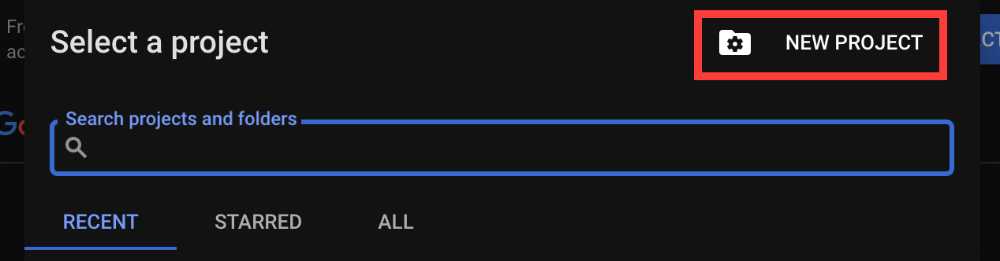
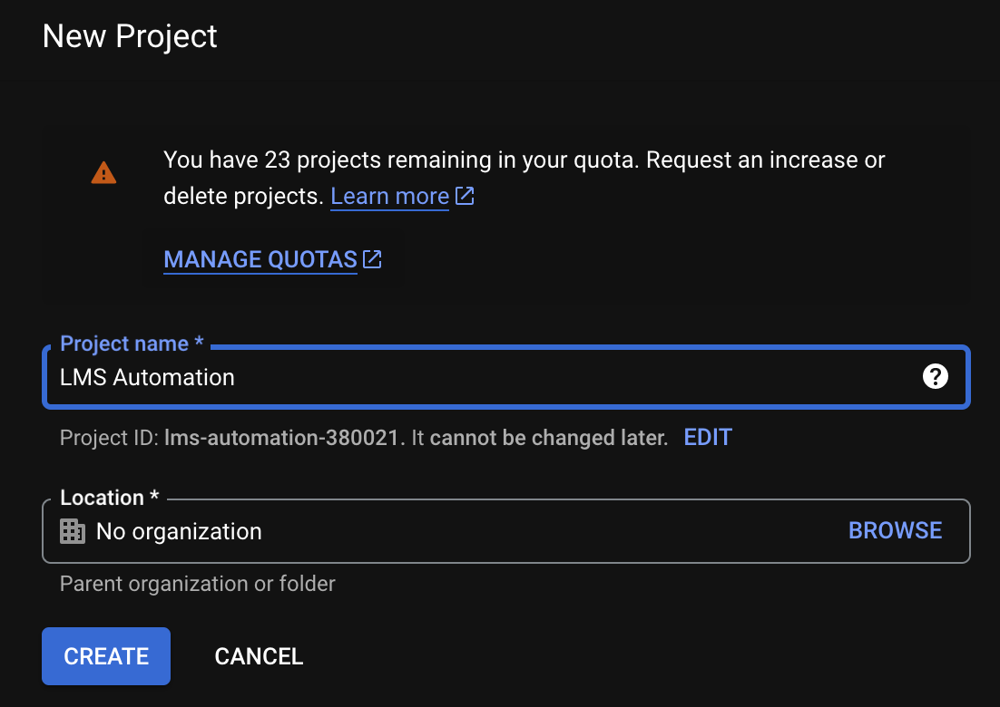
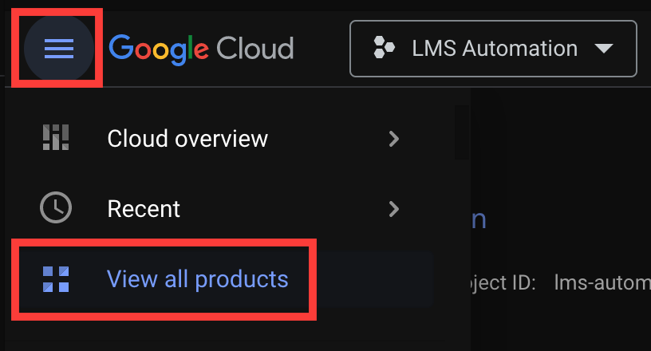
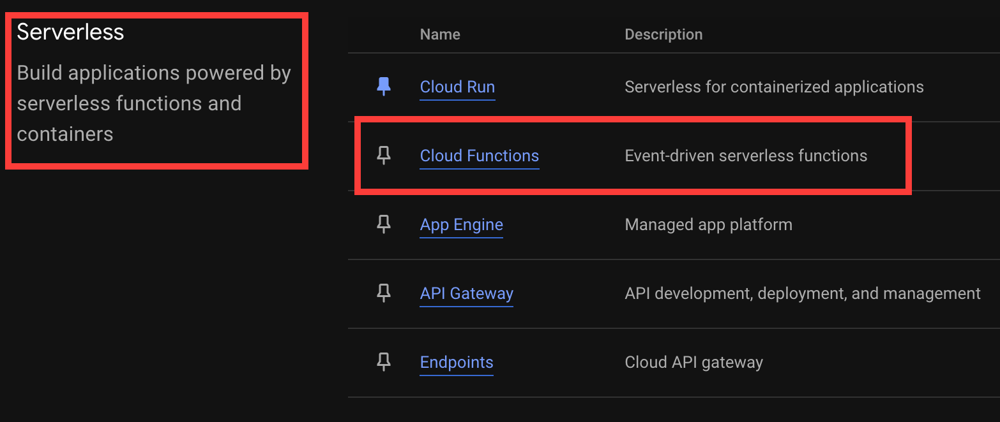

# Google Cloud Platform Setup
---

Next we'll begin tackling the core functionality of our app: Compiling and sending LMS reports from a Google Cloud Function.

We must first create a new Google Cloud Project. This is essentially a container that holds any cloud resources (databases, storage buckets, etc.) used in a single project, application, or system.

## Creating a New Google Cloud Project

In a new browser tab, visit [**_console.cloud.google.com_**](https://console.cloud.google.com). If you've never used Google Cloud Platform, you may be asked to log in with your Google account and/or accept Terms of Service.

At the top of the homepage, locate and click the _**Select a project**_ dropdown. A modal will appear. Click **_New Project_** in the upper-right corner:

Provide any **_Project name_** you'd like. Under **_Location_**, select the most appropriate parent organization for this tutorial's assets. _(If you're not sure what that means, leave the  default 'no organization' setting in place.)_

Click **_Create_**.

## Accessing Your Cloud Project

Locate the _**Select a project**_ dropdown menu in the upper menu again. Click it to access the project selector, and navigate to your new Google Cloud project.  

## Adding Services to a Project

Now we can begin adding services to our project. First up: Google Cloud Functions.

Open the left menu sidebar, and select **_View all products_**.

Navigate to the **_Serverless_** section, and click **_Cloud Functions_**:

You should see a _**Welcome to Cloud Functions**_ greeting. We're in!

---

| [⬅️  Back —](./2.1_apps_script_triggers.md) | [— 🏠 Home —](https://github.com/courtneyphillips/project-canis-educere) | [— Next  ➡️](./3.1_creating_a_google_cloud_function.md) |
| --- | --- | --- |
