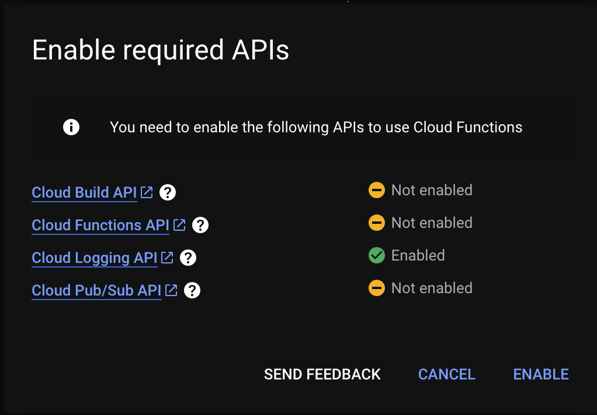
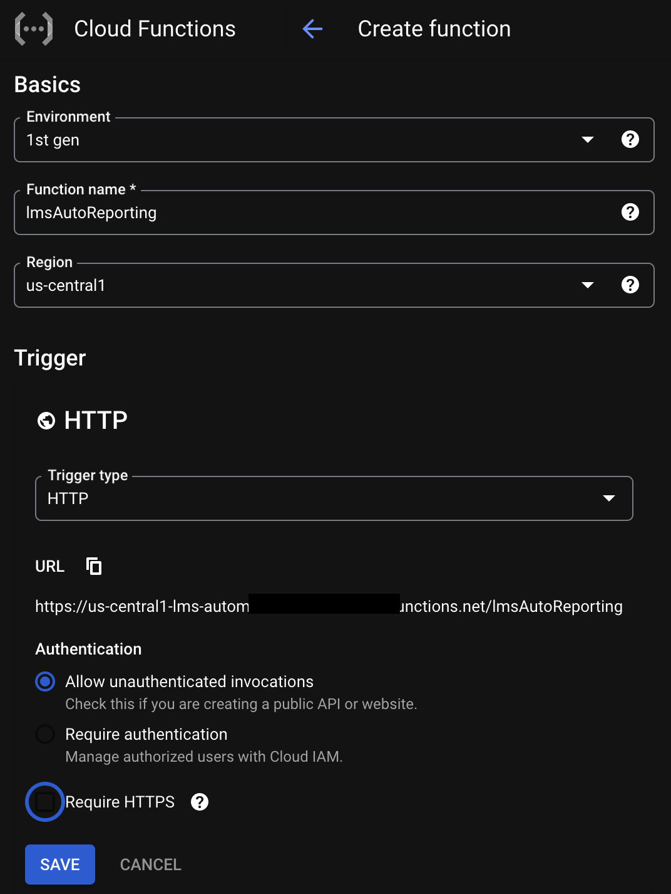
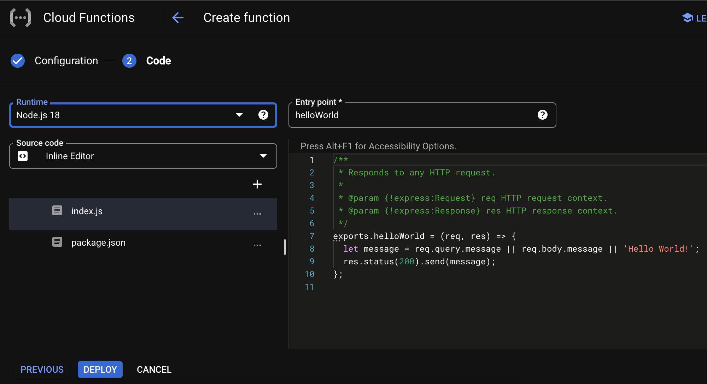

# Creating a Cloud Function
---

We should be located in our new Google Cloud Project, looking at a _**Welcome to Cloud Functions**_ page, like this:


From here, select **_Create Function_**.

## Enabling APIs

An **_Enable required APIs_** pop-up will appear:



These APIs are part of the Google Cloud Environment. They provide essential functionality—like logging, deployments, etc.—to Cloud Functions and other services.

Click _**Enable**_ to add them to your project. This may take several moments.

## Configuring a Cloud Function

Next, we'll see a _**Create function**_ form:



Let's walk through each configuration of our new function:

- `Environment`: **1st gen**. GCP currently offers two environments for Google Cloud Functions: 1st and 2nd gen. We'll use 1st gen.

- `Function name`: **lmsAutoReporting**. This is the name of our cloud function.

- `Region`: **default**. This is the physical location of the data center that will execute our function. For big high-traffic projects, it's important to select a region close to whatever entities the function will interact with, to minimize latency. For our project, leave the default suggestion in place.

- `Trigger type`: **HTTP**. This denotes how the cloud function should expect to be invoked. In our case, we'll send an HTTP request.

- `URL`: The new cloud function will automatically be assigned a URL based on its name and region. **Copy/paste this URL somewhere now. We'll need it in the next step.**

- `Authentication`: **Allow unauthenticated invocations**. Authentication is out of scope for this brief tutorial.

- `Require HTTPS`: **False**.

Confirm your configuration settings match those above, and hit _**Save**_, then **_Next_**.

## Code and Environment Options

After this, we'll be presented options for our function's code. Make sure your settings match those seen and listed below:  



- `Runtime`: **Node.js 18**

- `Source code`: **Inline editor**. This means we'll be adding and deploying new code directly from the in-browser text editor on the right side of this page. Handy!

- `Entry point`: **helloWorld**. Whatever method listed here will always run _first_ when our Cloud Function is invoked.

As you can see, our Cloud Function came with a basic `helloWorld()` method:

_**index.js** in Google Cloud Functions_
```JavaScript
/**
 * Responds to any HTTP request.
 *
 * @param {!express:Request} req HTTP request context.
 * @param {!express:Response} res HTTP response context.
 */
exports.helloWorld = (req, res) => {
  let message = req.query.message || req.body.message || 'Hello World!';
  res.status(200).send(message);
};
```

We'll keep this in place for now. It will act as our entry point while we confirm our Cloud Function works.

## Deploying a Cloud Function

Hit the blue _**Deploy**_ button in the lower-left of the inline editor page.

When we make changes to our Cloud Function, we will save them by deploying them to the cloud. Deployments take several moments. We know they've been completed successfully when a green checkmark appears next to the function name, like this:


---

| [⬅️  Back —](./3.0_google_cloud_platform_setup.md) | [— 🏠 Home —](https://github.com/courtneyphillips/project-canis-educere) | [— Next  ➡️](./3.2_invoking_a_cloud_function_via_HTTPS.md) |
| --- | --- | --- |
