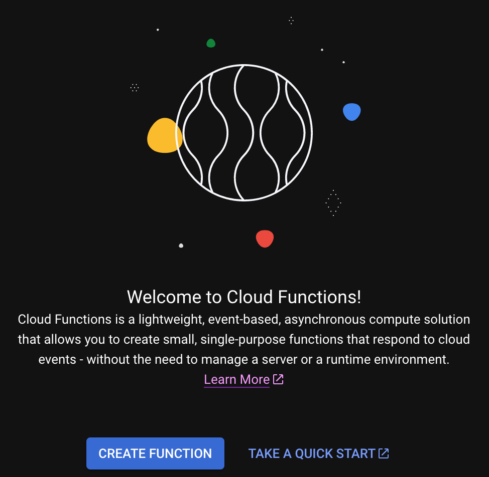

# Creating a Cloud Function
---

We should be located in our new Google Cloud Project, looking at a _Welcome to Cloud Functions_ page:



From here, select **_Create Function_** to begin constructing our first serverless cloud function

//button may not be available if you have not enabled billing?

## Enabling APIs

An **_Enable required APIs_** pop-up will appear:


These APIs are part of the Google Cloud Environment that provide essential functionality--like logging, deployments, etc.--to Cloud Functions and other services. Click _**Enable**_ to add them to your project. This may take several moments.

## Configuring a Cloud Function

Next, we'll see a _Create function_ page:


Let's walk through each configuration of our new function:

- `Environment`: **1st gen**. GCP currently offers two environments for Google Cloud Functions: 1st and 2nd gen. For our purposes, we will use 1st gen. The most notable difference between the two is that 2nd gen uses a multi-tenant architecture[^1]

- `Function name`: **lmsAutoReporting**. This is the name of our cloud function.

- `Region`: **default**. This refers to the region...

- `Trigger type`: **HTTP**. This denotes how we plan to invoke our new cloud function. Remember, Cloud functions are event-based...So, how will we notify it of the event? In our case, we'll send an HTTP request.

- `URL`: The new cloud function will automatically be assigned a URL based on its name and region. **Copy/paste this URL somewhere now. We'll need it in the next step.**

- `Authentication`: **Allow unauthenticated invocations**. Authentication is out of scope for this particular tutorial. However, note that this **is** considered best practice whenever youre' working with actual data, etc. For more information, [resource].

- `Require HTTPS`: **False**.

Confirm your configuration settings match those above, and hit _**Save**_. After reviewing everything looks correct, click **_Next_**.

## Editing a Cloud Function

- `Runtime`: Node.js 16
- `Source code`: Inline editor
- `Entry point`: This is the method that will run first whenever the cloud function is invoked from an outside event (in our case, that HTTP request we talked about).

**index.js** in Google Cloud Functions
```JavaScript
/**
 * Responds to any HTTP request.
 *
 * @param {!express:Request} req HTTP request context.
 * @param {!express:Response} res HTTP response context.
 */
exports.helloWorld = (req, res) => {
  let message = req.query.message || req.body.message || 'Hello World!';
  res.status(200).send(message);
};
```

For now, we'll keep this default example method.

## Deploying a Cloud Function

Hit the blue _**Deploy**_ button in the lower-left.

We'll be taken to the function hub/homepage/ where we can see metrics, details, logs, and other information.

Deployments may take several moments, even after our browser has navigated to another page. We can quickly see whether a deployment was successful by identifying the green checkmark next to the Cloud functions name, like this:


---

| [⬅️  Back —]() | [— 🏠 Home —](https://github.com/courtneyphillips/project-canis-educere) | [— Next  ➡️]() |
| --- | --- | --- |
