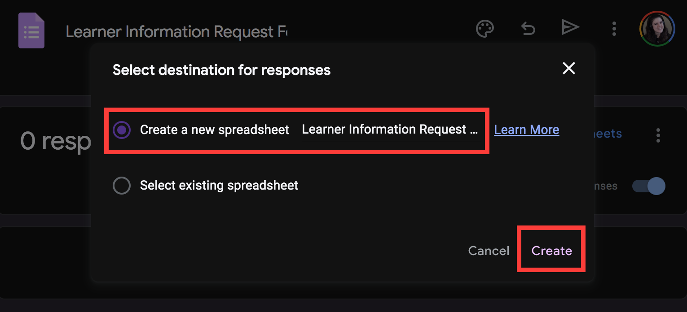

## Google Form Triggers

### Creating a Google Form

First we'll need a Google Form. This self-serve resource will allow stakeholders to receive up-to-date learning and certification performance on any one of the organizations that contracts with our SaaS company, at any time.

**Click [this link](https://docs.google.com/forms/d/1WWOQb1rrzaG91OU0jwOK8i9YSo9Ka2eyiJUeLMTUSWU/copy)** to make a copy of the Google Form used throughout this project. You will see a prompt like this:


Click the blue _Make a copy_ button. You will navigate to your personal copy of the form.

### Saving Form Submissions in a Spreadsheet

Next, we'll configure our Google Form to record responses in a Google Sheet. This sheet will both provide an anchor point to add our automated code too, and serve as a master list of all requests, should we ever need to review our process, or anything like that...  

From with in your new copy of the Google Form, select the _Responses_ tab. Then, click _Link to Sheets_.


You will be prompted to either select an existing sheet, or make a new sheet to collect responses. Select _Create a new spreadsheet_, then click _Create_.



You should automatically be taken to your new spreadsheet in Google Sheets.

### Testing the Form

Revisit your Google Form, select the menu option with the three vertical dots in the upper-right corner (also known as a kebab menu), then hit _Preview_ in the resulting drop-down.

This allows you to preview what your form will look like to users. From here, you can optionally submit test information into your form, and see it appear in the corresponding Google Spreadsheet.

### Event-Based Logic with Apps Script  

Great! Our Form works, and it can successfully record responses in our corresponding Google Sheet. Next up, we need to add the ability to run custom code automatically whenever the form is submitted.

This code will ultimately be responsible for beginning the process of creating and sending that automated report to our user...but for now, we'll keep it simple.

To add code to our Google Sheet, we'll click the _Extensions_ option in the upper toolbar. From the resulting dropdown menu, select _Apps Script_:


_Note: If you've never used Google Apps Script before, you may be prompted to provide access permissions. Accept all suggested permissions and proceed._

You should be taken to a new project within Apps Script that looks like this:


If this is your first time using Apps Script, notice a couple things here:

- On the left sidebar, we can see we're currently viewing a file called `Code.gs`
- On the right side of the screen, we have an in-browser code editor to write and save our Apps Script code directly in the browser.
- An empty function, called `myFunction()` has been provided for us.

Let's update the name of our function, and add a quick line of code, like so:

**Code.gs**
```javascript
function onNewFormSubmission(){
  console.log("hey, our function was invoked!")
}
```
After making any changes, be sure to save your progress by either selecting the save icon in the toolbar above the code editor, or using the command `CMD + S` on Mac, or `Ctrl + S` on Windows. 

Great! After these steps, we have a functioning Google Form to accept requests, and we've confirmed our ability to run a function automatically whenever this form is submitted. In our case, we'll want this function to invoke a Google Cloud Function that will pull LMS data and XYZ.

In the next lesson we'll begin creating this Google Cloud function, so that we may connect it to our apps script code!
