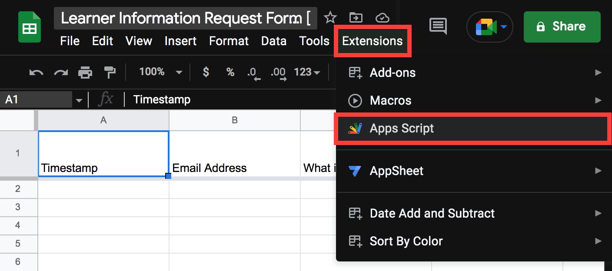
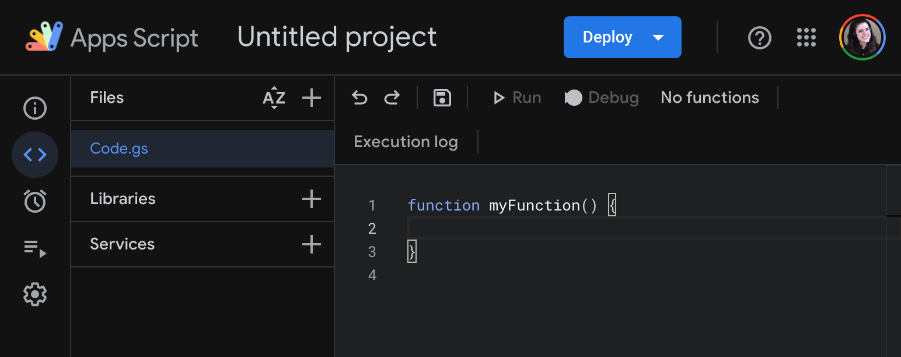
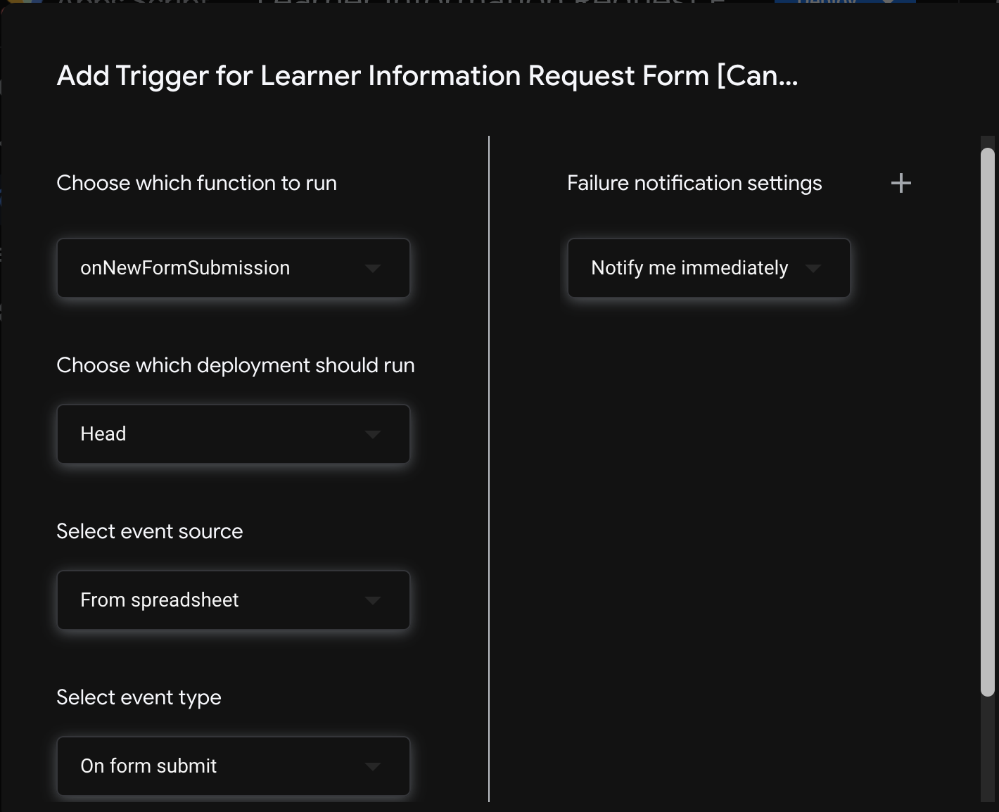

## Event-Based Logic with Apps Script  

Next, we'll integrate code that will run when our form is submitted. This code will be responsible for gathering data provided through the form, and eventually kicking off a series of workflows in Google Cloud Platform, to compile and send the user their requested LMS report.

At time of this writing, Google Sheets offers more expansive support for scripting and automation than Google Forms, so we'll integrate our code onto the sheet associated with our form.

Revisit the Google Sheet containing your form responses, and click the _Extensions_ option in the upper toolbar. From the resulting dropdown menu, select _Apps Script_:



| 🛠️  Project Note |
|--------------------|
| If you've never used Google Apps Script before, you may be prompted to provide access permissions. Accept all suggested permissions and proceed. |

You should be taken to a new project within Apps Script that looks like this:



Let's update the name of our function, and add a quick line of code, like so:

**Code.gs**
```javascript
function onNewFormSubmission(){
  console.log("hey, our function was invoked!")
}
```

Because this code will eventually run whenever our form is submitted, we've named our method `onNewFormSubmission()`. For now it includes a simple `console.log()` to display a message when invoked.

| ⚠️  Important  |
|--------------------|
| The Apps Script editor **_does not automatically save your work_**. Save manually after each change by clicking the save icon (💾) in the upper toolbar, or using the shortcut `CMD + S` on Mac (`Ctrl + S` on Windows). |

### Defining Triggers

Next, we need to specify to Apps Script exactly when this new function should run.

In the left sidebar of Apps Script, hover over the alarm clock icon and select _Triggers_. Click the blue _Add Trigger_ button in the lower-right corner of the resulting page.

A modal window will appear with configuration options for your new trigger. Update each option to match the image and list below:



- **Choose which function to run**: Select our `onNewFormSubmission()` function
- **Choose which deployment should run**: `Head`. In context of Apps Scripts, this refers to the version meant for publication (as opposed to testing or development). It's like a Git `master` branch.
- **Select event source**: Our event source is the spreadsheet.
- **Select event type**: On form submit.
- **Failure Notification settings**: Notification setting is immediately.

Click the blue _Save_ button after confirming your settings match those above.

### Invoking Triggers & Viewing Apps Script Logs

Let's try it out! Revisit the form preview, submit a test submission. Check to confirm it has appeared in the spreadsheet:

<image>

Let's see if that `console.log()` in our `onNewFormSubmission()` ran. That will confirm whether our new function was successfully invoked upon form submission.

In Apps Script,  `console.log()`s and other messages are recorded in the Execution Logs. We can access them by locating the Execution Logs option in the left sidebar.

<image>

Each of these entries represents an instance of our function running--that is, an execution. We can expand the most recent entry to see our `console.log()` message!

Great! We have a functioning Google Form to accept requests, and we've confirmed our ability to run a function automatically whenever this form is submitted.

In the next lesson we'll begin creating this Google Cloud function, so that we may connect it to our apps script code!

| [⬅️  Back —]() | [— 🏠 Home —]() | [— Next  ➡️]() |
| --- | --- | --- |
