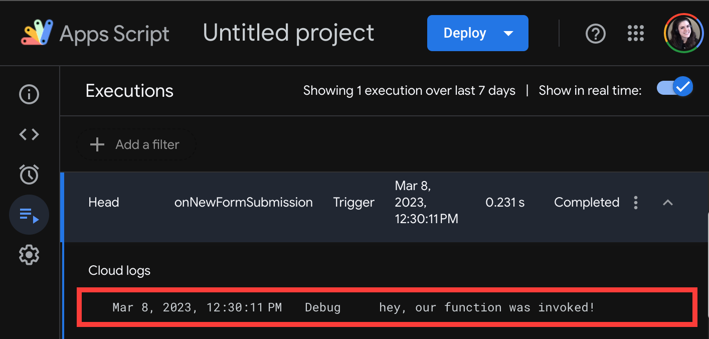

# Event-Based Logic with Google Apps Script   
---

Next we'll integrate code that will collect and send form data to our eventual Google Cloud Function. Google Sheets supports more expansive scripting than Forms, so we'll add this code to our spreadsheet.

Revisit the form response spreadsheet created in the last lesson. Click **_Extensions_** in the upper toolbar. Select **_Apps Script_** from the resulting dropdown.


| 🛠️  Project Note |
|--------------------|
| _If this is your first time using Google Apps Script, you may be receive a pop-up asking for permissions. Accept all suggested permissions and proceed._ |

You will navigate to a new project within Apps Script, like this:


Because we created this new Apps Script project directly from our spreadsheet, code here will automatically be associated with our sheet.

Let's update the name of our empty `myFuntion()`, and insert a logging statement:

**Code.gs** in Apps Script
```javascript
function onNewFormSubmission(){
  console.log("hey, our function was invoked!")
}
```

| ⚠️  Important  |
|--------------------|
| The Apps Script editor **_does not automatically save your work_**. Save manually after each change by clicking the save icon (💾), or using the shortcut `CMD + S` on Mac, or `Ctrl + S` on Windows. |

## Defining Triggers

Next, we'll tell the function when to run. In the left sidebar of Apps Script, select **_Triggers_** (⏰). On the resulting page, click the blue **_Add Trigger_** button in the lower-right:


A modal with configuration options will appear. Update each to match the following:


- **Choose which function to run**: `onNewFormSubmission`

- **Choose which deployment should run**: `Head`. This refers to the version meant for publication (as opposed to testing or development). It's a bit like a Git `master` branch.

- **Select event source**: `From spreadsheet`.

- **Select event type**: `On form submit`. Our spreadsheet is configured to automatically register new form submissions. When it receives this type of event, it will now also run our `onNewFormSubmission()` function.

- **Failure notification settings**: Your choice. We will walk through checking log data to locate errors, but you may opt for notifications.

Click the blue _**Save**_ button below these options after confirming your settings match.

## Invoking Triggers & Viewing Logs

We just told our `onNewFormSubmission()` function to run whenever the form is submitted; let's see it in action!

Revisit the form, fill out the fields, and submit it. We should see a second row appended to our spreadsheet:


But did our new `onNewFormSubmission()` run when the form was submitted? In Apps Script, `console.log()`s and other messages are recorded in Execution Logs. We can access them by through the **_Executions_** option in the left sidebar of Google Apps Script:


Each entry in the body of the Executions page represents an instance of our function running. We can expand the sole entry to see our `console.log()` message:



Great! We've confirmed that our function runs automatically whenever the form is submitted.

| [⬅️  Back —]() | [— 🏠 Home —]() | [— Next  ➡️]() |
| --- | --- | --- |
