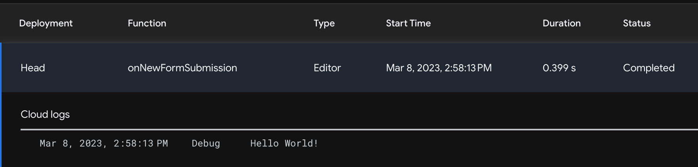
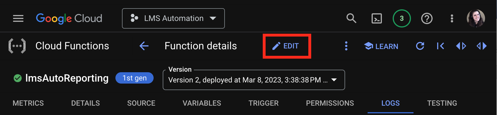
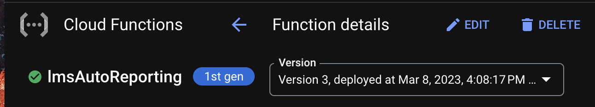
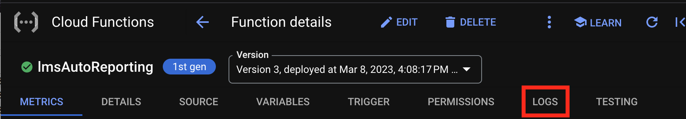
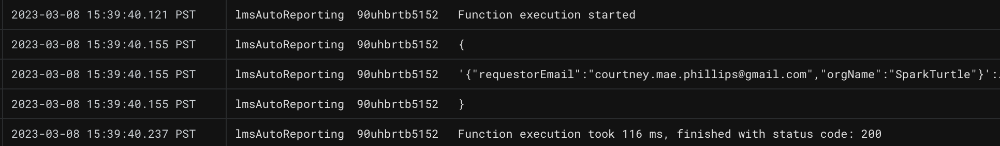

# Sending Dynamic Payloads to Cloud Functions
---

Now that we've confirmed the Apps Script on our Google Form and our Cloud function are communicating, we can send our form data to the cloud.

Remember, our internal stakeholders will submit our form to request an LMS/certification report on the customer, team, or organization they specify. The Cloud Function will use this information to query the LMS API, and email relevant data to the requestor.

## Accessing Form Fields

In our Google Form Apps Script, we'll add an `event` argument to capture details about the form submission events triggering our script.

As outlined in [Google documentation](https://developers.google.com/apps-script/guides/triggers/events#form-submit), form field data resides in a `values` array on the `event` object. We'll include these values in our HTTP request, like this:

**Code.gs** in Apps Script
```JavaScript
const cloudFunctionsLocation = "YOUR-UNIQUE-CLOUD-FUNCTIONS-URL-HERE";

function onNewFormSubmission(event) {
  let payloadToSendToGCP = {
    "method": "POST",
    "payload": JSON.stringify(
      {
        "requestorEmail": event.values[1],
        "orgName": event.values[2],
      }
    )
  }
  let response = UrlFetchApp.fetch(cloudFunctionsLocation, payloadToSendToGCP);
  let result = response.getContentText();
  console.log(result);
}
```

We can send another test submission through our Google Form, revisit the Apps Script execution logs, and see a new completed execution, with the same `Hello World!` message from GCP:



Great, our HTTP request is still functional. But did the cloud function receive values from our form? Let's check!

### Logging in Cloud Functions

We'll return to our Cloud Function in the Google Cloud Console, and select the **_Edit_** option:



Configuration options will open first. We don't need to alter anything here, so click **_Next_** at the bottom of the page.

This will open our inline code editor. Let's add a `console.log()` call to log the body of the request received from Apps Script:

**index.js** in Google Cloud Functions
```javascript
exports.helloWorld = (req, res) => {
  let message = req.query.message || req.body.message || 'Hello World!';
  console.log(req.body);
  res.status(200).send(message);
};
```

This will allow us to see what our Cloud function is receiving from the HTTP request in our Apps Script. Click the blue **_Deploy_** button to save changes.

Upon deploying, we're redirected to the homepage of our Cloud Function. We will see a green checkmark next to our function name when the deployment is successful.



Once our deployment is complete, we can send another sample submission through our Google Form.

This time, we'll view the logs for our Google Cloud Function by selecting the **_Logs_** tab on the Cloud Function homepage:



If we scroll down to the most recent logs at the bottom, we should see record of the form data being sent from Google Apps Script!


