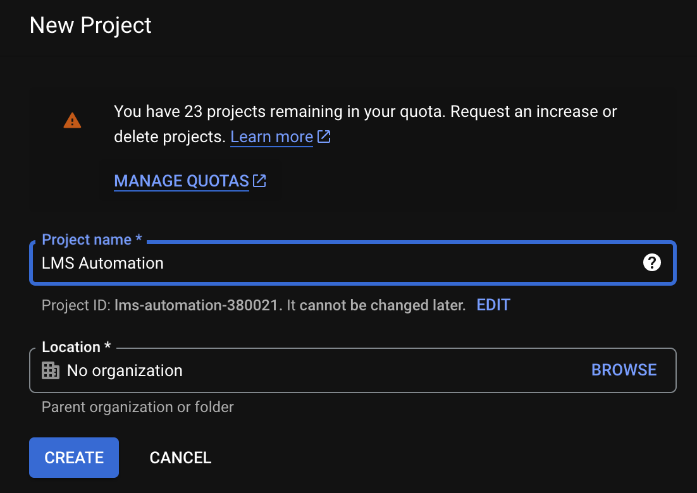

# Google Cloud Platform Setup
---

We've confirmed our Apps Script code will run whenever a new form is submitted. Next we'll begin tackling the core functionality of our app: Compiling and sending LMS reports from a Google Cloud Function!

To do this, we must first create a new Google Cloud Project. This is essentially a container that holds any cloud resources (databases, storage buckets, etc.) used in a single project or system. Organizing them together helps developers manage permissions, billing, dependencies, and more.

Even though we're only using a single cloud service, Google Cloud Functions, we must still house this service within a project.  

## Creating a New Google Cloud Project

In a new browser tab, visit **_console.cloud.google.com_**. (You may be asked to log in with your Google account and/or accept Terms of Service.)

At the top of the homepage, locate and click the _**Select a project**_ dropdown menu.

A modal will appear. Click **_New Project_** in the upper-right corner:

Under **_Project name_** provide any name you'd like. Under **_Location_**, select the most appropriate parent organization for this tutorial. (Not sure what this means? No worries! Leave the default _No organization_ setting.)

Click **_Create_** to launch your new project.

## Accessing Your Cloud Project

Locate the _**Select a project**_ dropdown menu again in the upper toolbar. Click it to access the project selector, and select the new project you just created.  

## Adding Services to a Project

After creating and navigating to our new project, we can begin adding services. For this tutorial, we'll use one single Google Cloud Service: Google Cloud Functions.

Click the left menu option to reveal a sidebar. In this sidebar, select **_View all products_**.

This will take you to a big master catalog of all available Google Cloud Platform projects. Each of these can be added to a Project, like the one we just created, in a matter of a few clicks. Pretty cool, right?

For our purposes, we specificallyw ant to use Google Cloud Functions to define and execute a serverless function-as-a-service. We can scroll to the **_Serverless_** section, locate **_Cloud Functions_** and click it:

---

| [⬅️  Back —]() | [— 🏠 Home —]() | [— Next  ➡️]() |
| --- | --- | --- |
