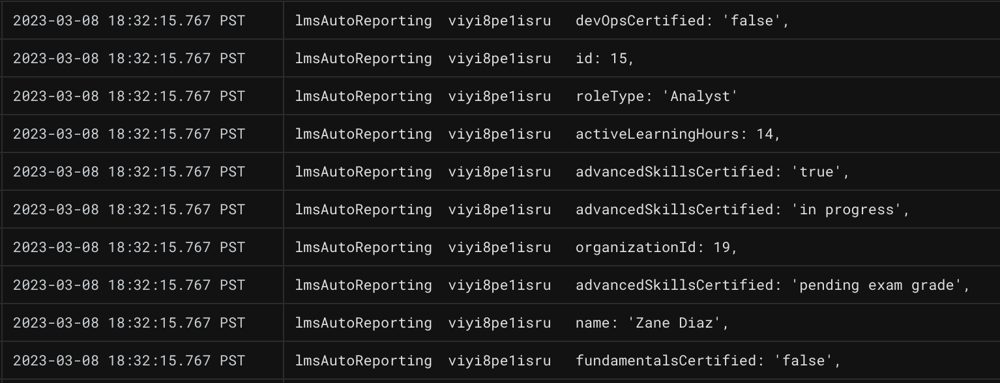

# Multiple API Queries in Cloud Functions
---

Our Cloud Function can now receive dynamic form data via HTTP request, and use it to return  corresponding data from the LMS API.

### Dependent API Calls

As seen in the [API documentation](https://github.com/courtneyphillips/canis-educere-mock-api), our LMS data is RESTful; each `Learner` includes an `organizationId` that corresponds to the `id` of the `Organization` they belong to.

Our Cloud Function is currently returning `Organization`s. We can use their `id`s in a second query to locate and return `Learner`s belonging to that `Organization`.

Returning to the Google Cloud inline code editor, let's add a second function for this second query:

_**index.js** in Google Cloud Functions_
```JavaScript
const https = require('https');

function retrieveLearnerDataByOrg(parsedOrgData, callback = () => {}) {
  let url = 'https://mockend.com/courtneyphillips/canis-educere-mock-api/learner?orgId_eq=' + encodeURIComponent(parsedOrgData[0].id);
  https.get(url, (response) => {
    let data = '';
    response.on('data', (chunk) => {
      data += chunk;
    });
    response.on('end', () => {
      console.log("parsedData");
      const parsedLearnerData = JSON.parse(data);
      callback(parsedLearnerData);
    });
  }).on('error', (err) => {
    console.error(err);
    callback([]);
  });
}

exports.serveLmsReports = (req, res) => {
  let url = 'https://mockend.com/courtneyphillips/canis-educere-mock-api/organization?companyName_eq=' + encodeURIComponent(req.body.orgName);
  https.get(url, (response) => {
    let data = '';
    response.on('data', (chunk) => {
      data += chunk;
    });
    response.on('end', () => {
      const parsedOrgData = JSON.parse(data);

      // Retrieve the learner data by passing in the parsed organization data and a callback function that will receive the parsed learner data

      retrieveLearnerDataByOrg(parsedOrgData, (parsedLearnerData) => {
        console.log(parsedLearnerData);
        res.status(200).send("Request successfully processed!")
      });

      // don't forget to make the changes above

    });
  }).on('error', (err) => {
    console.error(err);
    res.status(500).send('Oh no, there was an error in processing your request. Check Logs for GCP and Apps Scripts.');
  });
};
```

This new function is largely the same as the last API call we constructed together, with several minor differences:

- We don't `export` because it is only used in this file, and therefore does not need to be exposed.

- It accepts `Organization` data returned by `serveLmsReport()` as an argument, so it may access and insert an Organization `id` into the query URL.

- We provide a callback as an argument, so it may report back to the parent `serveLmsReport()` function where it is invoked.

After making these changes, we can **_Deploy_**, and submit another sample form. If we revisit the Cloud Logs we should see learner data successfully returned from the LMS: 



---

| [⬅️  Back —](./4.0_querying_an_api_from_cloud_functions.md) | [— 🏠 Home —](https://github.com/courtneyphillips/project-canis-educere) | [— Next  ➡️](./5.0_setting_up_sendgrid.md) |
| --- | --- | --- |
