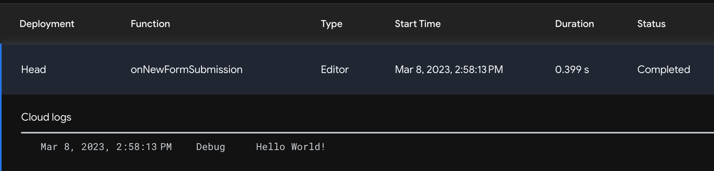

# Triggering a Cloud Function via HTTP
---

We now have two important pieces of our automation in place:

1. A Google Form and Sheet that runs specified code when new submissions are received.
2. A Google Cloud Function configured to trigger via HTTP request.

Now let's connect them. We'll update our form/sheet script to invoke our cloud function via HTTP. After confirming they can communicate, we'll pass actual form input data to the cloud function.

## Contacting a Cloud Function via HTTP

Let's revisit the Apps Script code attached to our form and spreadsheet. (If you don't have this readily available, you can revisit the Google Sheet created to record your form data, and select _Extensions_ > _Apps Script_ from the top toolbar)

Our code currently looks like this:

**code.gs** in Google Apps Script
```JavaScript
function onNewFormSubmission(){
  console.log("hey, our function was invoked!")
}
```

Let's update it to contact the cloud. First, we'll provide the location of our Cloud Function as a constant, and construct the JSON for our HTTP request:

Next we'll construct the JSON for our HTTP request:

**code.gs** in Google Apps Script
```javascript
const cloudFunctionsLocation = "YOUR-UNIQUE-CLOUD-FUNCTIONS-URL-HERE";

function onNewFormSubmission() {
  let payloadToSendToGCP = {
    "method": "POST",
    "payload": JSON.stringify({"message": "Hello, cloud function! How's the weather up there?"})
  }
}
```

(If you didn't record this in the previous lesson, revisit your cloud function in the GCP dashboard. Hit _Edit_ and scroll down to the `Trigger URL` value)_

Then we'll send our HTTP request. Conveniently, Apps Script has a built-in HTTP client called [UrlFetchApp](https://developers.google.com/apps-script/reference/url-fetch/url-fetch-app).We'll use its [`fetch()` method](https://developers.google.com/apps-script/reference/url-fetch/url-fetch-app#fetch(String,Object)) to make a simple request, grab the response text, and log it to the console:

**code.gs** in Google Apps Script
```javascript
const cloudFunctionsLocation = "YOUR-UNIQUE-CLOUD-FUNCTIONS-URL-HERE";

function onNewFormSubmission() {
  let payloadToSendToGCP = {
    "method": "POST",
    "payload": JSON.stringify({"message": "Hello, cloud function! How's the weather up there?"})
  }
  let response = UrlFetchApp.fetch(cloudFunctionsLocation, payloadToSendToGCP);
  let result = response.getContentText();
  console.log(result);
}
```

Make sure to save your changes.

So, this function will attempt to contact our GCP Cloud function at the URL location provided, via an HTTP POST request with the message `"Hello, cloud function! How's the weather up there?"``

Now remember, our cloud function currently looks like this:

```JavaScript
exports.helloWorld = (req, res) => {
  let message = req.query.message || req.body.message || 'Hello World!';
  res.status(200).send(message);
};
```

...So, if we receive a `Hello World` message back, we'll know the script in our google sheet/form has made successful contact!

Let's try it out! Revisit the preview of your Google Form, and submit more sample data.

If we revisit the Executions log of our Apps Script, we can see record of a new execution! Expanding this entry reveals the `Hello World!` message from GCP!



<details><summary>⛔ **Did you receive a log error?**: Click here for guidance </summary>
<br>
<p>
If you received an Apps Script log error reading `Exception: You do not have permission to call UrlFetchApp.fetch.`, it is because Apps Script does not have authorization to make HTTP requests from your Google Account.
</p>
<p>
To grant permissions, return to the Apps Script editor. Click **_Run_** (▶️) in the top toolbar. You'll see a pop-up asking for permissions. Enable them. You may receive another pop-up warning _Google hasn't verified this app_. At the bottom of this window is a tiny link reading _Go to [project name] (unsafe)_. Click this. In the resulting pop-up you will have the option to allow permissions.
</p>
<p>
It may feel questionable to ignore these warnings--that's good instincts! You should never allow strangers this level of access into your account. _**However**_, notice that **you** are listed as both the developer and the party granting permission. You are allowing your own script access to your own account.
</p>
<p>
At the conclusion of this module, we'll give you a reminder to optionally revoke permissions, disable API keys, and perform other preventative safety measures.
</p>
</details>

### Gathering and Sending Dynamic Parameters

Now that we know they're communicating, let's send the data that stakeholders submit in our form to the GCP cloud function. Our cloud function will eventually be responsible for pulling and sending data from our LMS. This will inform it which data to send.

We'll add `event` as an argument to our method. This will capture details about the event that's triggering our function (in our case, a form submission).

We're accessing the `values` by calling `event.values`

Then, in our payload, we're accessing the details of this event to capture what the user has submitted in form fields:

```JavaScript
const cloudFunctionsLocation = "YOUR-UNIQUE-CLOUD-FUNCTIONS-URL-HERE";

function onNewFormSubmission(event) {
  var payloadToSendToGCP = {
    "method": "POST",
    "payload": JSON.stringify(
      {
        "requestorEmail": newSubmissionInfo[1],
        "orgName": newSubmissionInfo[2],
      }
    )
  }
  let response = UrlFetchApp.fetch(cloudFunctionsLocation, payloadToSendToGCP);
  let result = response.getContentText();
  console.log(result);
}
```


**code.gs** in Google Apps Script
```javascript

const cloudFunctionsLocation = "https://us-central1-project-canis-educere.cloudfunctions.net/createLearnerReport"

function onNewFormSubmission(event) {
  var newSubmissionInfo = event.values;
  Logger.log(newSubmissionInfo);
  var payloadToSendToGCP = {
    "method": "POST",
    "payload": JSON.stringify(
      {
        "requestorEmail": newSubmissionInfo[1],
        "orgName": newSubmissionInfo[2],
      }
    )
  }
  Logger.log(payloadToSendToGCP);
  var response = UrlFetchApp.fetch(cloudFunctionsLocation, payloadToSendToGCP);
  var result = response.getContentText();
  Logger.log(result);
}
```
