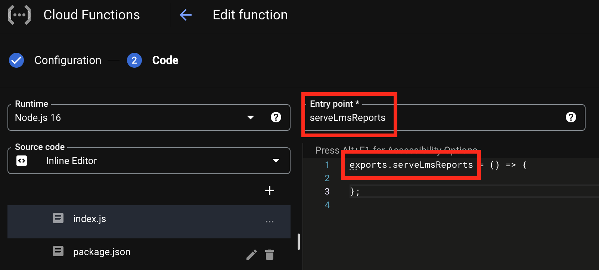
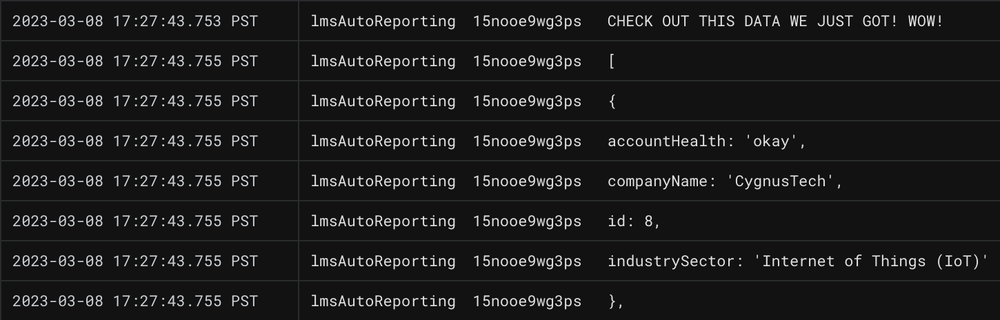

# Querying APIs from Cloud Functions
---

We've confirmed our Google Form is triggering an Apps Script, which then sends form data to our Google Cloud Function. Now that we have this data in the cloud, we can use it to query our LMS database.

| 🛠️  Project Note |
|--------------------|
| For the purposes of this tutorial, we will be using a mock LMS REST API constructed for this exercise. For details and documentation, review the [Mock API Repository](https://github.com/courtneyphillips/canis-educere-mock-api) on GitHub.  |

## Cloud Function Entry Points

Let's revisit the Cloud Console inline editor and write our method to query the LMS API. We'll remove replace `helloWorld()` with something new:

**index.js** in Google Cloud Functions
```JavaScript
exports.serveLmsReports = () => {

};
```

`serveLmsReports()` will be our new entry point. That is, the logic that _always_ runs first when our Cloud Function is triggered. You must update the entry point field above the inline code editor to reflect our new method name:



**If the entry point specified is not available, the cloud function will not execute correctly.**

## Constructing HTTP Requests

Next, we'll begin to construct the HTTPS request to pull data from the LMS API. Because we selected Node.js 16 as our runtime environment, we have access to Node's built-in [HTTPS Module](https://nodejs.org/api/https.html).

We'll require the module at the top of our file, and outline an empty HTTPS request:  

**index.js** in Google Cloud Functions
```JavaScript
const https = require('https');

exports.serveLmsReports = (req, res) => {

  https.get(url, (response) => {
    // what do we do with the response we'll get back?

    response.on('end', () => {
      // what should happen when the HTTP request concludes?
    });

  }).on('error', (err) => {
    // what should happen if the HTTP request hits an error?
  });

};
```

Here, we begin an HTTP GET request with `get()`, attach `on()` listeners to react differently to two potential event outcomes:  

- `end`, referring to the end of the transmission of data from the
- `error`, referring to any error events returned by the response

We'll add our API endpoint url, and begin specifying what to do with returned API data:

**index.js** in Google Cloud Functions
```JavaScript
const https = require('https');

exports.serveLmsReports = (req, res) => {
  let url = 'https://mockend.com/courtneyphillips/canis-educere-mock-api/organization?companyName_eq=' + encodeURIComponent(req.body.orgName);

  https.get(url, (response) => {
    let data = '';
    response.on('data', (chunk) => {
      data += chunk;
    });

    response.on('end', () => {
      // what should happen when the HTTP request concludes?
    });

  }).on('error', (err) => {
    // what should happen if the HTTP request hits an error?
  });

};
```

In the HTTPS tool, data is returned in a stream of small "chunks" instead of one big payload. This allows clients to begin processing data before it's all received, and helps reduce network issues.

In our code above, we accumulate each `chunk` of data into a singular `data` variable as it's received.

After all chunks are received, the `response` will emit an `end` event. Let's specify what should occur upon `end` next:

**index.js** in the Google Cloud Functions Console
```JavaScript
const https = require('https');

exports.serveLmsReports = (req, res) => {
  let url = 'https://mockend.com/courtneyphillips/canis-educere-mock-api/organization?companyName_eq=' + encodeURIComponent(req.body.orgName);

  https.get(url, (response) => {
    let data = '';
    response.on('data', (chunk) => {
      data += chunk;
    });

    response.on('end', () => {
      const parsedOrgData = JSON.parse(data);
      console.log("CHECK OUT THIS DATA WE JUST GOT! WOW!");
      console.log(parsedOrgData);
      res.status(200).send("Request successfully processed by the contactLMS function in GCP!")
    });

  }).on('error', (err) => {
    // what should happen if the HTTP request hits an error?
  });

};
```

Here, we simply parse our newly-returned data, log it in the console for now, and send a 200 'OK' status back as a response, with a success message.

Finally, let's specify what should occur in case of `error`:

**index.js** in the Google Cloud Functions Console
```JavaScript
const https = require('https');

exports.serveLmsReports = (req, res) => {
  let url = 'https://mockend.com/courtneyphillips/canis-educere-mock-api/organization?companyName_eq=' + encodeURIComponent(req.body.orgName);
  https.get(url, (response) => {
    let data = '';
    response.on('data', (chunk) => {
      data += chunk;
    });
    response.on('end', () => {
      const parsedOrgData = JSON.parse(data);
      console.log("CHECK OUT THIS DATA WE JUST GOT! WOW!");
      console.log(parsedOrgData);
      res.status(200).send("Request successfully processed by the contactLMS function in GCP!")
    });
  }).on('error', (err) => {
    console.error(err);
    res.status(500).send('Oh no, there was an error in processing your request. Check Logs for GCP and Apps Scripts.');
  });
};
```

Here, we log the error, and send a 500 response back with an error message.

We can use the blue **_Deploy_** button once again to save our changes.

After code is successfully deployed to the Cloud Function, we can submit a sample form again, access our cloud function logs, and see our freshly-retrieved API data recorded in our Cloud Function logs!


