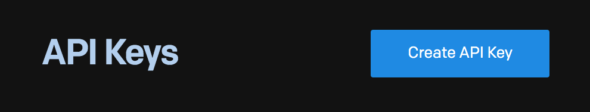

Great! At this point, our Google Cloud Function is accessing all the information it needs to generate LMS reports on a given organization or team. Next up, we just need to compile and email that information to the requestor. To do this, we'll use the SendGrid API. SendGrid is a Twilio API with a generous free tier.

## Creating a Free SendGrid Account

If you don't already have one, register for a new SendGrid account on their website. After logging into your new account, Locate the _Settings_ option in the left sidebar. Under settings, select _API Keys_. On the API keys page, click the blue _Create API Key_ button:

Select either Full Access API Key (this tutorial will remind you to delete API keys no longer in use after you finish the project), or if you'd prefer, a restricted key that includes mail send capabilities.

| ⚠️  Important Note |
|--------------------|
| **Capture your new SendGrid API key immediately**. If you navigate away from this page, SendGrid will not re-display your key. Keep this tab open throughout the next lesson. Or copy/paste it into a temporary local file now. |

---

| [⬅️  Back —]() | [— 🏠 Home —](https://github.com/courtneyphillips/project-canis-educere) | [— Next  ➡️]() |
| --- | --- | --- |
