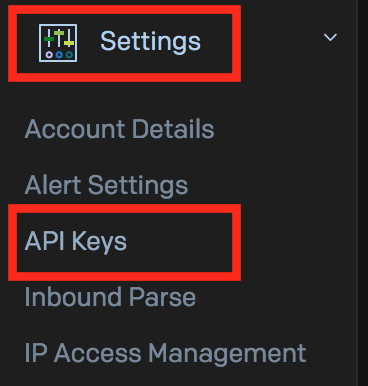
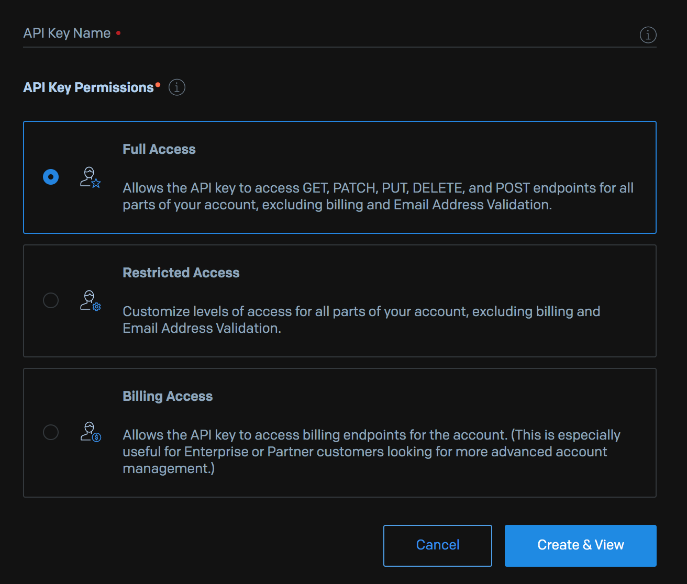

# Setting up SendGrid
---

Great! Our Cloud Function is accessing all the necessary information to generate LMS reports on a given organization.

Next we need to compile and email this information to the requestor. To do this, we'll use the SendGrid API.

## Creating a Free SendGrid Account

If you don't already have one, register for [**a new SendGrid account on their website**](https://signup.sendgrid.com).

After logging into your new account, Locate the _**Settings**_ option in the left sidebar. Under _**Settings**_, select _**API Keys**_.

On the API keys page, click _**Create API Key**_:

Give your key a descriptive _**Key Name**_ you will remember. Select either _**Full**_ or _**Restricted**_ access that **includes mail send capabilities**.

Click _**Create & View**_ to see your new key.

⚠️ **Capture your API key immediately** ⚠️. If you navigate away from this page, SendGrid will not re-display your key. Keep this tab open throughout the next lesson. Or copy/paste into a temporary local file now.

---

| [⬅️  Back —](./4.1_nested_api_requests_in_gcp.md) | [— 🏠 Home —](https://github.com/courtneyphillips/project-canis-educere) | [— Next  ➡️](./5.1_managing_api_keys_in_google_cloud_secret_manager.md) |
| --- | --- | --- |
