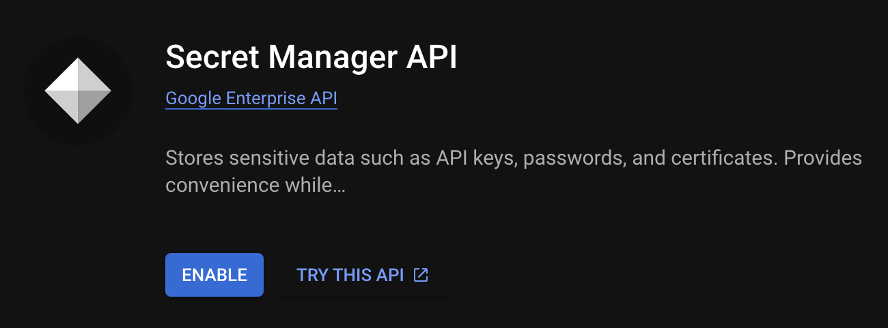
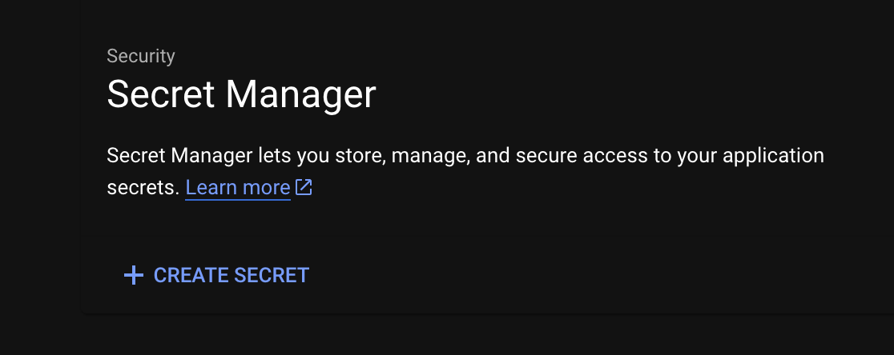
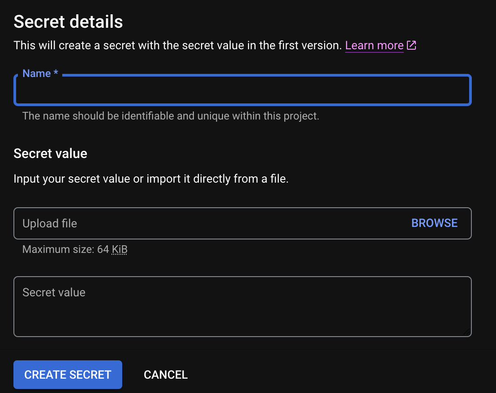
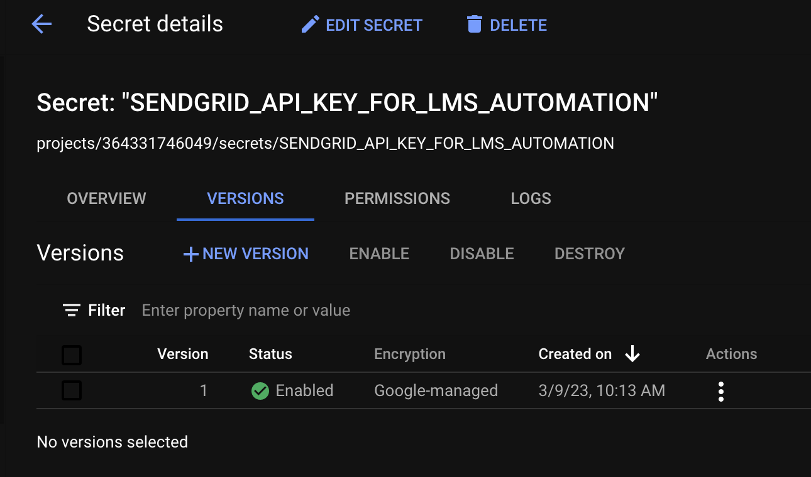
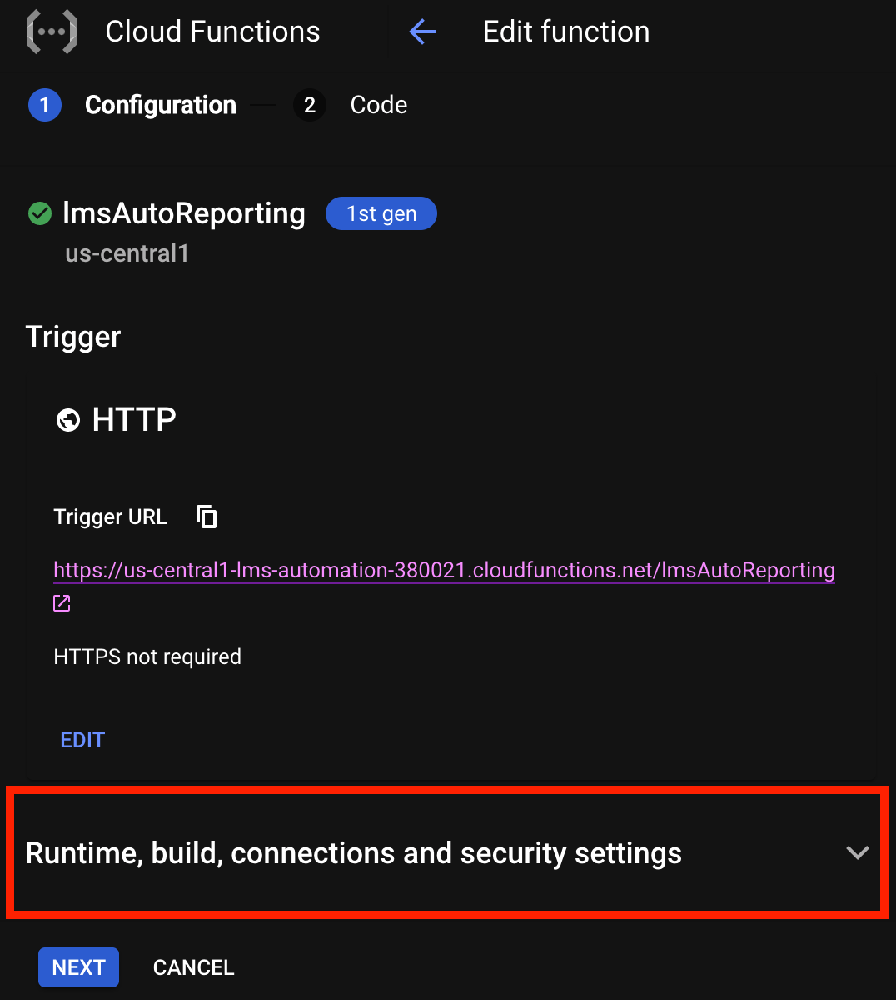
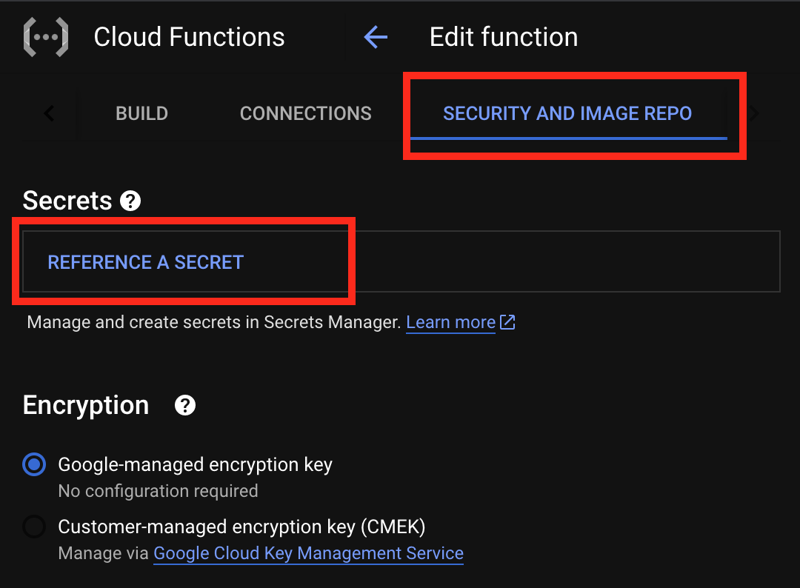
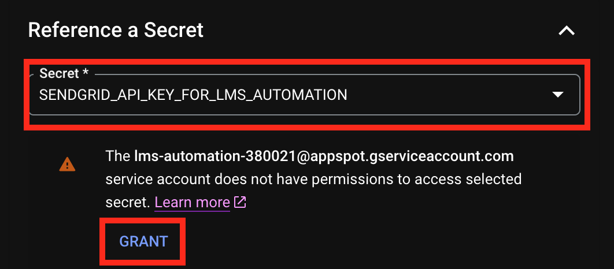
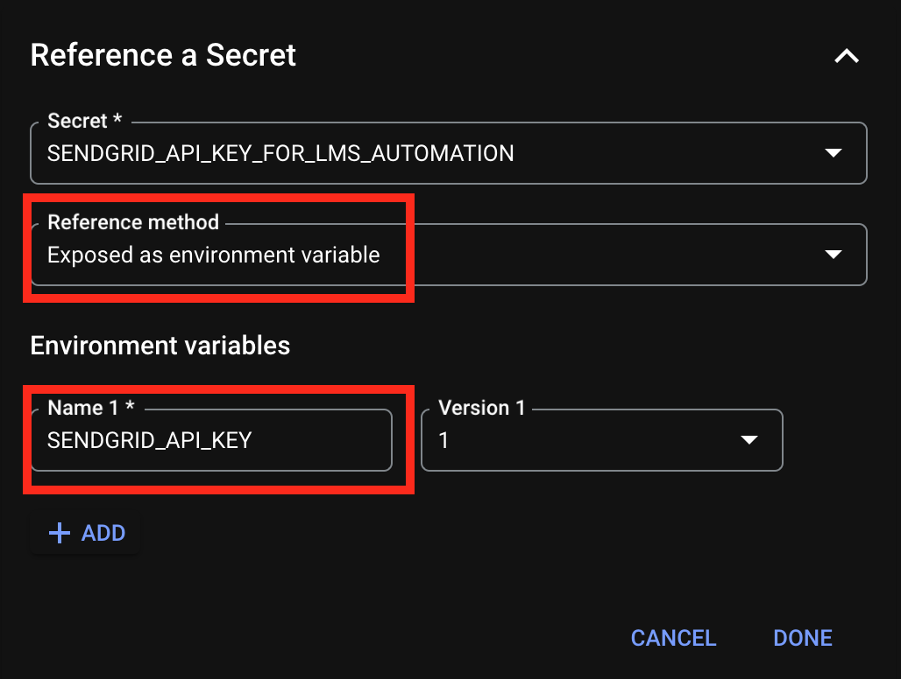

# Managing Keys with Google Cloud Secret Manager
---

Cloud platforms are known for making programming easier by abstracting away complexity. Securely managing sensitive values is yet another of the many processes that Google Cloud Platform can abstract for us.

GCP offers a tool called Google Secret Manager. It can be used to encrypt and store sensitive values used in our cloud projects (like passwords, API keys, certificates, etc.), and dole out access through fine-grained authentication policies.

We'll use Google Secret Manager to handle our new SendGrid API key.  

## Creating a New Secret

Navigate to the Google Secret Manager Tool by [**clicking this link**](https://console.cloud.google.com/security/secret-manager). On the resulting page, click _**Enable**_:



After enabling, select **_Create Secret_**.



This will load a form to create a new secret:



Give your new secret a _**Name**_ of your choosing (remember what you name it!) Then copy/paste your SendGrid API key directly into the _**Secret value**_ form field.

| ⚠️  Important Note |
|--------------------|
| Be **very careful** to ensure your API Key is copied over _exactly_ how it appears in SendGrid. A small missing character will cause authorization failures down the line. Even an extra whitespace--nearly invisible to the human eye--can cause difficult-to-diagnose issues. _Ask me how I know._ |

Once you're certain everything is correct, click _**Create Secret**_.

## Managing Secrets

You'll be taken to a page where you can later manager your secret; including viewing, enabling, disabling, and destroying:



## Providing Secrets to Cloud Functions

Next, return to your Cloud Function. Select the **_Edit_**:


On the first edit page, locate and expand the section titled _**Runtime, build, connections and security settings**_:



In this panel, select the _**Security and Image Repo Options**_ tab. You should see a link reading **_Reference a Secret_**. Click this link:



This will open a form. From the _**Secret**_ dropdown, select the secret you just created.

A message below the dropdown will appear, stating your project doesn't currently have permission to access this secret. Click _**Grant**_.



Complete the form by selecting _**Expose as environmental variable**_. This will reveal further variable options.

Give your environmental variable a name. **This will be the variable name you call directly in your code.**



Click _**Done**_. You will be provided the option to review your configurations. Click **_Next_**.

This will take you back to the Cloud Functions inline code editor. From here, we can access our new environmental variable at the top of our file:

_**index.js** in Google Cloud Functions_
```JavaScript
const https = require('https');
const SENDGRID_API_KEY = process.env.SENDGRID_API_KEY;

// Make sure the line above references YOUR environmental variable name!

[...]
```

---

| [⬅️  Back —](./5.0_setting_up_sendgrid.md) | [— 🏠 Home —](https://github.com/courtneyphillips/project-canis-educere) | [— Next  ➡️](./5.2_sending_emails_via_api.md) |
| --- | --- | --- |
