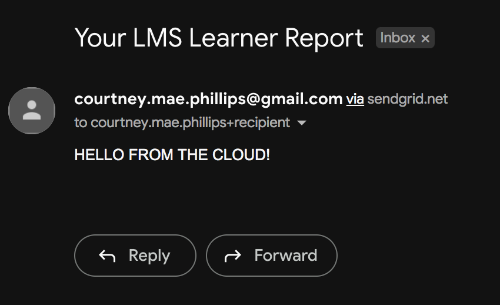
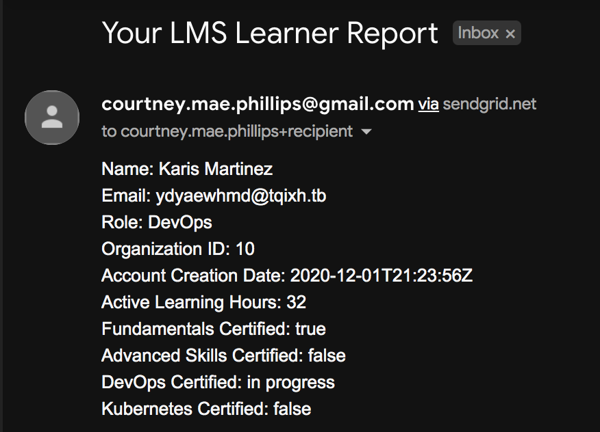

# Sending Emails from Cloud Functions

---

Now that we're safely managing our SendGrid API key in Google Secrets, we're ready to begin communicating with the SendGrid API. SendGrid will deliver LMS reports on our behalf.

## Installing Node Libraries

We can add the SendGrid npm package to our cloud function by opening our `package.json` file in the inline editor.

We'll add a `"dependencies"` section with `"@sendgrid/mail"` version `7.7.0`:

_**package.json** in Google Cloud Functions_
```json
{
  "name": "sample-http",
  "version": "0.0.1",
  "dependencies": {
    "@sendgrid/mail": "^7.7.0"
  }
}
```

Each time we deploy, GCP automatically runs `$ npm install`. This means we can add new packages directly to `package.json` without additional `npm` commands.

Next, we'll import the SendGrid library into our Cloud Function with `require`:

_**index.js** in Google Cloud Functions_
```javascript
const https = require('https');
const SENDGRID_API_KEY = process.env.SENDGRID_API_KEY;
const sgMail = require('@sendgrid/mail');

[...] // file truncated for brevity

```

Next we'll define a `compileAndSendEmailReport()` function that constructs the JSON payload [required by the SendGrid API](https://docs.sendgrid.com/for-developers/sending-email/api-getting-started). It'll include hard-coded details for now:

_**index.js** in Google Cloud Functions_
```javascript
const https = require('https');
const SENDGRID_API_KEY = process.env.SENDGRID_API_KEY;
const sgMail = require('@sendgrid/mail');

function compileAndSendEmailReport(orgData, learnerData, callback = () => {}){
  sgMail.setApiKey(SENDGRID_API_KEY);
  const emailObject = {
    to: '<YOUR-EMAIL-ADDRESS-HERE>',
    from: '<YOUR-EMAIL-ADDRESS-HERE>',
    subject: 'Your LMS Learner Report',
    text: "HELLO FROM THE CLOUD!"
  }
  sgMail.send(emailObject).then(() => {
      console.log('Email sent');
      callback('email sent')
    })
    .catch((error) => {
      console.error(error)
      console.error("error sending")
      callback([])
    })
}

[...] // file truncated for brevity
```

| ⚠️  Important Note |
|--------------------|
| Once we begin calling the SendGrid API it **will send real emails**. This in mind, **use your own address** for all testing! <br><br>Want to mix it up? Gmail supports adding a suffix to existing addresses with `+`. Use this to create as many "new" addresses as you'd like. They'll all be sent to your regular inbox. (e.g. `your-email+TESTRECIPIENT@gmail.com`, `your-email+TESTREQUESTOR@gmail.com`, etc.)  |


Then, we'll call our new function in `serveLmsReport()`:

_**index.js** in Google Cloud Functions_
```JavaScript
[...] // file truncated for brevity

exports.serveLmsReports = (req, res) => {
  let url = 'https://mockend.com/courtneyphillips/canis-educere-mock-api/organization?companyName_eq=' + encodeURIComponent(req.body.orgName);
  https.get(url, (response) => {
    let data = '';
    response.on('data', (chunk) => {
      data += chunk;
    });
    response.on('end', () => {
      const parsedOrgData = JSON.parse(data);
      retrieveLearnerDataByOrg(parsedOrgData, (parsedLearnerData) => {
        console.log(parsedLearnerData);

        // New code to call & log our new method below!

        let emailConfirmation = compileAndSendEmailReport(parsedOrgData, parsedLearnerData);
        console.log(emailConfirmation);

        //New code above!

        res.status(200).send("Request successfully processed!")
      });
    });
  }).on('error', (err) => {
    console.error(err);
    res.status(500).send('Oh no, there was an error in processing your request. Check Logs for GCP and Apps Scripts.');
  });
};
```

_**Deploy**_ updates, and submit another form. Open the inbox of the email address used in your request, and you should see a new message!



Next, we can use basic JavaScript to format an display the actual learner data in the body of our email:

_**index.js** in Google Cloud Functions_
```javascript
const https = require('https');
const SENDGRID_API_KEY = process.env.SENDGRID_API_KEY;
const sgMail = require('@sendgrid/mail');

function compileAndSendEmailReport(orgData, learnerData, callback = () => {}){
  sgMail.setApiKey(SENDGRID_API_KEY);

  // New code to compile a report below

  let report = "";

  learnerData.forEach((learner) => {
    report += `Name: ${learner.name}\n`;
    report += `Email: ${learner.email}\n`;
    report += `Role: ${learner.roleType}\n`;
    report += `Organization ID: ${learner.organizationId}\n`;
    report += `Account Creation Date: ${learner.accountCreation}\n`;
    report += `Active Learning Hours: ${learner.activeLearningHours}\n`;
    report += `Fundamentals Certified: ${learner.fundamentalsCertified}\n`;
    report += `Advanced Skills Certified: ${learner.advancedSkillsCertified}\n`;
    report += `DevOps Certified: ${learner.devOpsCertified}\n`;
    report += `Kubernetes Certified: ${learner.kubernetesCertified}\n\n`;
  });

  // new code to compile a report above

  const emailObject = {
    to: '<YOUR-EMAIL-ADDRESS-HERE>',
    from: '<YOUR-EMAIL-ADDRESS-HERE>',
    subject: 'Your LMS Learner Report',

    // this line has been updated to use our new text report!

    text: report

    // new line above!

  }
  sgMail.send(emailObject).then(() => {
      console.log('Email sent');
      callback('email sent')
    })
    .catch((error) => {
      console.error(error)
      console.error("error sending")
      callback([])
    })
}

[...] // file truncated for brevity
```

After deploying changes, another test form submission should reveal learner data in our inbox!



It's just a simple list of `Learner` attributes. But now that our automation can successfully collect and send this data, calculating metrics and organizing information in a more actionable format should be a simple matter of JavaScript logic.  

What do you want to do with your data? How can you transform your `report` string before passing it to the SendGrid API? What helper methods could you define?

---

| [⬅️  Back —](./5.1_managing_api_keys_in_google_cloud_secret_manager.md) | [— 🏠 Home —](https://github.com/courtneyphillips/project-canis-educere) | [— Next  ➡️](./5.3_dynamic_email_recipients_with_sendgrid.md) |
| --- | --- | --- |
